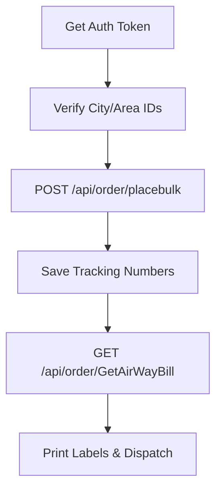
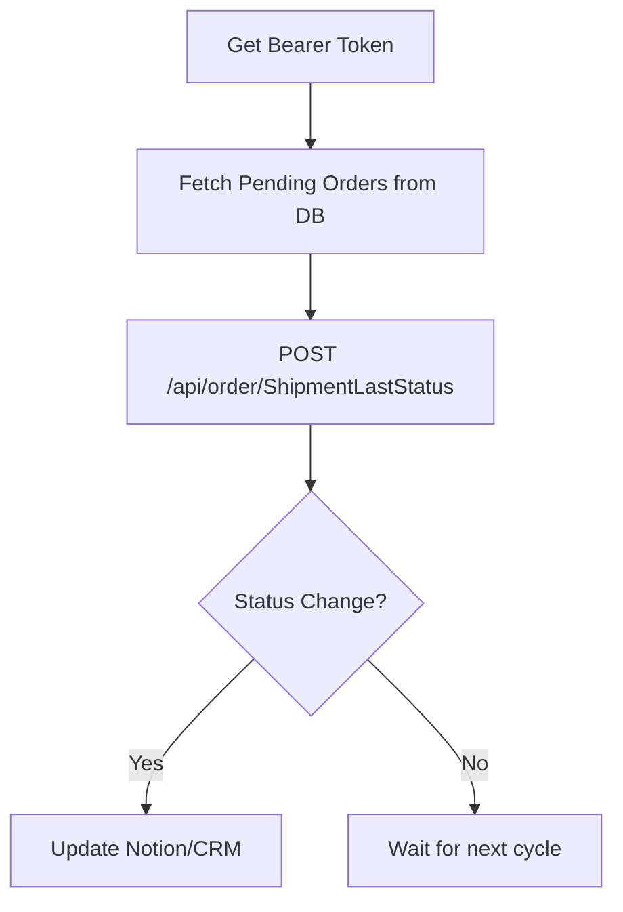

# Filex Delivery API — SKILL.md
> Reference document for AI agents building workflows with the Filex Delivery API.
> Covers authentication, location lookups, order placement, tracking, and labels.

---

## 1. FOUNDATION

### Base URL
```
http://filex-shipperapi.dispatchex.info/
```

### Authentication
Filex uses OAuth2 Bearer tokens. You must first generate a token and then include it in the `Authorization` header for all subsequent requests.

**Endpoint:** `POST /GetAuthToken`
**Content-Type:** `application/x-www-form-urlencoded`

**Parameters:**
| Parameter | Required | Description |
|---|---|---|
| `Username` | Yes | API Username |
| `Password` | Yes | API Password |
| `grant_type` | Yes | Must be `password` |
| `AccountNumber` | Yes | Your Filex Account Number |

**Success Response:**
```json
{
  "access_token": "YOUR_BEARER_TOKEN",
  "token_type": "bearer",
  "expires_in": 3599
}
```

**Header for other requests:**
`Authorization: Bearer YOUR_BEARER_TOKEN`

---

## 2. LOCATION LOOKUPS
Before placing an order, verify the City and Area to ensure accurate routing.

### 2.1 Get Cities
**Endpoint:** `GET /api/CommonAPI/Cities`
**Query Params:** `countryID=1` (for UAE/specific regions)

### 2.2 Get Areas
**Endpoint:** `GET /api/CommonAPI/Areas`
**Query Params:** `acityID` (ID obtained from the Cities endpoint)

---

## 3. ORDER MANAGEMENT

### 3.1 Place Bulk Orders
**Endpoint:** `POST /api/order/placebulk`
**Content-Type:** `application/json`

**Body Structure:**
```json
{
   "list":[
      {
         "RecipientName": "John Doe",
         "TotalCOG": "150.00",
         "MobileNumber": "971XXXXXXXXX",
         "ShipperRef": "ORD-1001",
         "AddressCountry": "United Arab Emirates",
         "City": "Dubai",
         "Area": "Downtown",
         "Street": "123 Main St",
         "MobileNumber2": "",
         "Remarks": "Signature required",
         "NumberOfPieces": "1",
         "Desc1": "Clothing Items"
      }
   ]
}
```

**Key Fields:**
- `TotalCOG`: The Cash on Delivery amount to be collected.
- `ShipperRef`: Your internal Order ID or Reference.
- `Desc1`: Description of the items in the parcel.

---

## 4. LABELS & TRACKING

### 4.1 Get Airway Bill (AWB) Labels
**Endpoint:** `GET /api/order/GetAirWayBill`
**Query Params:** `TrackingNos` (comma-separated list of tracking numbers)

### 4.2 Get Last Status
Used to check the current delivery status of one or more orders.
**Endpoint:** `POST /api/order/ShipmentLastStatus`
**Content-Type:** `application/json`

**Body:**
```json
{
   "trackingNos": "5200555669,5200555731"
}
```

### 4.3 Get Full Tracking History
Detailed timeline for a specific shipment.
**Endpoint:** `POST /api/order/GetShipmentTrackingHistory`
**Query Params:** `TrackingNo`

---

## 5. COMPLETE WORKFLOW BLUEPRINTS

### Blueprint A — Fulfillment Workflow


### Blueprint B — Status Sync (Periodic)


---

## 6. GOTCHAS & COMMON ERRORS
| Problem | Cause | Fix |
|---|---|---|
| 401 Unauthorized | Token expired or invalid | Refresh token via `/GetAuthToken` |
| Order Rejected | Invalid City/Area | Use the Lookup endpoints (Section 2) for valid names |
| Missing Tracking No | Order didn't process | Check `placebulk` response for specific error messages |
| Casing Issues | JSON fields are Case-Sensitive | Use exactly `RecipientName`, `TotalCOG`, etc. as shown above |
